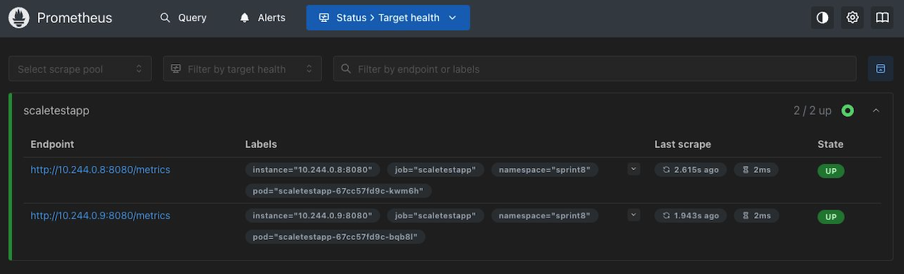

# Динамическое масштабирование

HPA по памяти: от 1 до 10 реплик, `requests.memory = 20Mi`, `limits.memory = 30Mi`, цель — 80% от requests. HPA по RPS: в среднем 10 запросов в секунду на pod, метрики через Prometheus и Adapter.

## Результаты

Тесты в Minikube, длительность каждого — 180 секунд.

| проверка | нагрузка | результат |
|---|---|---|
| память | 1 500 пользователей, запуск по 50/с | реплики 1 → 2 → 3; 83 284 запроса, 78 469 ошибок |
| RPS | 150 пользователей, запуск по 5/с | реплики 1 → 2 → 4 → 5; 8 278 запросов, ошибок нет |

[HPA: память](results/memory-watch.txt) 

[Locust: память](results/memory-locust.txt)

[HPA: RPS](results/rps-watch.txt)

[Locust: RPS](results/rps-locust.txt)

По памяти реплики добавились, но HPA не предотвратил OOMKilled и ошибки соединений. Успешная обработка 1 500 пользователей не подтверждена. Последняя строка `memory-watch.txt` с `0/10` относится уже к HPA по RPS.

