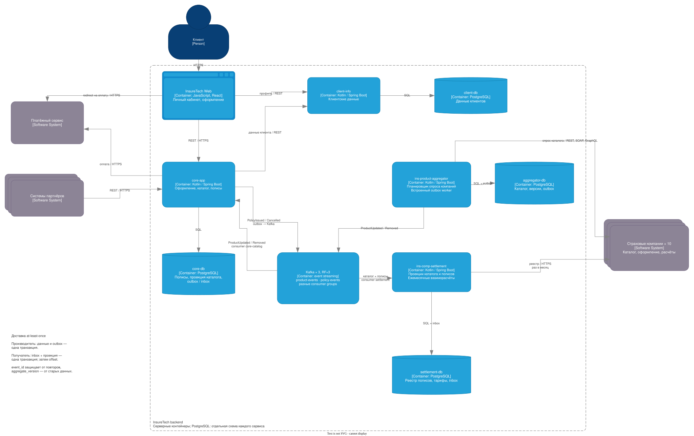

# Переход на события

## Проблемы

Синхронный запрос каталога ждёт все страховые компании. При росте с пяти до десяти компаний увеличатся число вызовов и вероятность задержек.

| проблема | решение |
|---|---|
| медленный страховщик задерживает общий ответ | независимый фоновый опрос, таймауты и ограничение параллелизма |
| больше страховых компаний | распределение опросов во времени |
| core-app обновляет каталог раз в 15 минут, settlement — раз в сутки | поток изменений в локальные копии обоих сервисов |
| ночная выгрузка полисов нагружает core-app, сбой может привести к пропуску | события оформления и отмены |
| ошибка API может затереть каталог | последняя успешная версия, таймаут не считается удалением |
| повтор события может удвоить начисление | уникальный `event_id`, inbox и изменение данных одной транзакцией |

## Решение

Выбирем Kafka с потоками каталога и полисов. ins-product-aggregator обновляет каталог, core-app оформляет страховки, ins-comp-settlement ведёт взаиморасчёты.

1. ins-product-aggregator опрашивает компании раз в 5 минут, с учётом квот API;
2. каталог и `ProductUpdated` / `ProductRemoved` записываются вместе с outbox. Удаление — только по успешному полному ответу или явному признаку удаления;
3. outbox worker отправляет события в Kafka. У core-app и settlement отдельные consumer groups, оба получают весь каталог;
4. core-app сохраняет полис и `PolicyIssued` одной транзакцией с outbox, отмену передаёт через `PolicyCancelled`;
5. settlement обновляет локальный реестр и раз в месяц отправляет его страховщикам.

client-info, оплата и пользовательские команды остаются синхронными.

## Доставка

| настройка | значение |
|---|---|
| Kafka | три брокера по зонам, replication factor 3, `min.insync.replicas = 2`, `acks = all` |
| каталог | `product-events`, ключ `insurer_id:product_id` |
| полисы | `policy-events`, ключ `policy_id` |
| событие | `event_id`, `event_type`, `schema_version`, `aggregate_id`, `aggregate_version`, `occurred_at`, данные изменения |

Transactional Outbox нужен обоим производителям: изменение БД и событие сохраняются вместе, отправка отмечается после подтверждения Kafka. Возможны повторы, поэтому consumer записывает inbox вместе с данными и затем фиксирует offset.

Порядок сохраняется внутри объекта, `aggregate_version` защищает от старых обновлений. В событии полиса передаются сумма и версия тарифа на момент оформления, без персональных документов.

При сбое Kafka события ждут в outbox. При недоступности страховщика остаётся прежний каталог с временем обновления, перед оформлением цена подтверждается. Ошибочные события после ограниченных повторов уходят в error topic с алертом.

Каталог восстанавливается из compacted topic с событиями удаления, реестр полисов — из snapshot с позицией потока и последующих событий. Retention не заменяет backup. Проверяем lag, возраст outbox и время последнего опроса компаний.
